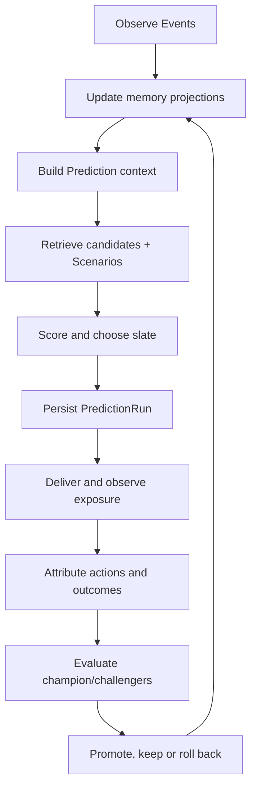

# Kajo Prediction Nervous System

Status: canonical product, memory, learning and evolution architecture.

## 1. Thesis

Kajo predicts the next experience that is likely to fit a `Profile` **in the current situation**. It does not build isolated “book taste” and “movie taste” systems.

A language model predicts a useful next token from an ordered context. Kajo's long-term direction is analogous:

```text
ordered behavior history
+ current HumanState
+ current Context
+ available Items
+ DiscoveryMode
-------------------------
next useful experience
```

The analogy concerns sequence modeling, shared representations, memory retrieval and outcome learning. Kajo is not a chat model, and a general-purpose LLM is not automatically a reliable recommender.

## 2. Non-negotiable invariants

- Prediction targets `Profile`, never User directly.
- The acting `User` remains separately traceable.
- `PersonalProfile` and `SharedProfile` memories are distinct.
- `SharedProfile` is learned joint state, not an average of member lists.
- `Item` and the prediction boundary remain cross-domain and provider-neutral.
- Event evidence is append-only; current state and memory summaries are rebuildable projections.
- A Prediction intended for learning records the complete candidate/slate trace and model/policy versions.
- Exposure, engagement, preference, consumption and delayed satisfaction are different evidence classes.
- Dwell is not equivalent to satisfaction.
- Memory is evidence with age and confidence, not permanent identity.
- Evolution never mutates the production champion without evaluation, rollout gates and rollback.
- Restricted provider metadata is not used for ML/AI training without the necessary licence.

## 3. The complete loop



The online loop updates state and serves rankings. The offline loop evaluates and evolves predictors. They share versioned evidence but remain operationally separate.

## 4. Memory hierarchy

### 4.1 WorkingState — active working memory

Purpose: represent what is happening inside the current session without pretending it is lasting taste.

Evidence:

- active `sessionId`, Profile and actor,
- current ItemType/surface,
- recent impressions, opens and explicit actions in sequence order,
- current DiscoveryMode and mode changes,
- current search/query constraints when implemented through MVP-DISC-009,
- session depth and time since the last action.

Lifetime: session-scoped; a new session starts after an intentional app/session boundary or prolonged inactivity. It can be reconstructed from Events and should not require model retraining.

Example: three quick comedy skips followed by two long thriller detail views may change this session's candidate mix without rewriting the Profile's enduring identity.

### 4.2 ShortTermState — lähimuisti

Purpose: capture intent, mood-like drift and temporary interests across sessions.

MVP V1 basis:

- recent window: 14 days,
- primary exponential time scale: 7 days,
- explicit actions dominate passive observations,
- positive and negative tag evidence are retained separately,
- cross-domain evidence is allowed when features share meaning.

The required MVP-ALG-004 multi-scale representation should preserve approximately session, week and month summaries rather than one arbitrary cutoff. The time scales are feature versions, not hard-coded truths.

Update behavior:

- explicit feedback affects it immediately,
- weak passive evidence needs repetition,
- contradictory newer evidence can reverse it quickly,
- inactivity decays it toward neutral.

### 4.3 LongTermState — kaukomuisti

Purpose: represent slowly changing, durable tendencies: novelty appetite, pacing, complexity, emotional intensity, darkness/lightness, familiarity, experimental preference and other learned latent dimensions.

MVP V1 basis:

- exponential long-term time scale centered on 180 days,
- top positive and negative tag evidence,
- confidence derived from independent/repeated evidence,
- explicit ratings and consumption outcomes carry more weight than opens.

LongTermState is not an immutable label. It must support:

- gradual drift,
- confidence reduction after inactivity,
- contradiction and reversal,
- provenance back to supporting Events,
- separate Personal and Shared state.

Cold-start onboarding and imported histories initialize priors. Their influence must fall as native Kajo behavior accumulates.

### 4.4 ScenarioMemory — episodic memory

A `Scenario` answers:

> When a Profile in a state like this faced options like these under this context and policy, what happened next and how good was the eventual outcome?

Conceptual shape:

```text
STATE
  Profile type + WorkingState + ShortTermState + LongTermState

CONTEXT
  time bucket + weekday/weekend + domain + surface + DiscoveryMode

DECISION
  candidate pool + returned order + scores + confidence + policy/model versions

OBSERVATION
  meaningful impressions + opens + dwell + actions

OUTCOME
  not interested / save / list / endorsement / consumption / rating / later reversal
```

#### Scenario retrieval

MVP V1 retrieves at most 30 same-Profile historical episodes. Similarity combines:

| Component | V1 share | Meaning |
|---|---:|---|
| HumanState overlap | 40% | overlap of positive/negative short- and long-term tag summaries |
| candidate/Item overlap | 35% | generic Item tag Jaccard similarity; exact same Item has a high floor |
| DiscoveryMode | 15% | exact mode is closest; FOR_YOU↔RISK is furthest |
| temporal Context | 10% | local-hour proximity and weekend/weekday match |

Cross-domain retrieval is allowed with a modest penalty. A book episode can therefore help a movie only through shared features, not merely because both are popular.

Retrieval applies a 180-day recency decay and a minimum similarity threshold. Scenario influence is confidence-shrunk when support is sparse. This allows useful one-shot evidence without letting one accidental action dominate indefinitely.

#### Outcome precedence

One episode may produce several Events. V1 selects the strongest available outcome for `(predictionId, itemId)`:

1. rating,
2. consumption reversal,
3. not interested,
4. consumed,
5. list addition,
6. endorsement/like,
7. saved/unsaved.

A later rating therefore replaces a weaker early save as the episode's main outcome. Undo Events exclude the reversed evidence. Dwell and open remain supporting observations, not terminal reward.

#### Scenario score

For candidate (i):

\[
S_i = c(n) \cdot
\frac{\sum_{e \in topK} r_e\,sim(e,i)\,decay(e)}
     {\sum_{e \in topK} sim(e,i)\,decay(e)}
\]

where (r_e \in [-1,1]), (K=30), and (c(n)) shrinks low-support evidence. DiscoveryMode controls how strongly this signal affects the base score: highest in `FOR_YOU`, lower in `SURPRISE`, lowest in `RISK`.

### 4.5 PopulationMemory — semantic/collaborative memory

Purpose: learn patterns that no single Profile has enough evidence to learn alone.

It is post-MVP and blocked until consent, data volume, deletion lineage and minimum-cohort privacy gates exist.

Future components:

- collaborative Item embeddings from co-occurrence and outcomes,
- Profile/Scenario clusters rather than exposed identities,
- cross-domain semantic Item space,
- Kajo-derived popularity/trend priors corrected for exposure bias,
- cold-start transfer,
- cohort and global scenario retrieval.

PopulationMemory never permits the mobile client to inspect other Profiles. Retrieval returns aggregated features/signals only. Sensitive/special-category inference is prohibited. Provider-owned aggregate popularity/trend metadata used by `ColdStartPrior` is not PopulationMemory because it is not derived from other Kajo Profiles.

## 5. Prediction trace: the system's causal spine

### PredictionRun

One hosted request records internally:

```text
predictionId
actorUserId
profileId
sessionId?
requestedAt
requestedItemType?
DiscoveryMode
bounded Context
MemoryStateSnapshot
modelVersion
baseModelVersion
policyVersion
experimentKey?
candidateCount
resultCount
```

### PredictionCandidate

Every considered candidate records:

```text
predictionId + itemId
sourceRank + sourceScore
finalRank + finalScore
confidence
scenarioScore + support + maxSimilarity
selectedForDelivery
selectionProbability?     # required when a stochastic policy is introduced
inspectable explanation
```

`selectedForDelivery` is not proof of exposure. `ITEM_IMPRESSION` is emitted only when the UI's visibility threshold is met. This distinction prevents unseen lower-screen cards from being treated as rejections.

For `resurfacing-v1`, the internal explanation also records the candidate's resurfacing classification, eligibility, reason, save age and reminder-history counters. A suppressed Item may remain in the internal candidate trace for evaluation/debugging while `selectedForDelivery=false`; Lists and history remain independent read surfaces and are not filtered by discovery eligibility.

For `shared-common-fit-v1.1`, a Shared candidate explanation also records only safe aggregate fields: accepted-member count/coverage, aggregate mean/minimum fit, consensus component, disagreement range/penalty, neutral prior, direct Shared-evidence count and final common-fit contribution. Raw Personal histories, member User IDs and PersonalProfile IDs are never written into the Shared candidate explanation.

### Why full slates matter

Without alternatives, “B was selected” is only a positive pair. With the trace, Kajo can learn that B won against A/C/D, which model placed it second, which cards were actually visible and whether the later rating supported the choice.

## 6. Context contract

V1 stores an allowlisted Context only:

- server request time,
- locale and timezone,
- local hour,
- day of week,
- discovery surface,
- session correlation.

It does **not** collect raw touch coordinates, contact lists, microphone/camera content, advertising IDs, precise location or background sensor data.

Future Context fields require all of:

1. a product use case,
2. predictive/evaluation hypothesis,
3. legal basis and permission where required,
4. canonical schema and retention rule,
5. ablation evidence that the signal provides value.

User-entered situational intent such as “together”, available time or desired mood is preferable to covert inference when the user experience can ask naturally.

## 7. Evidence and reward model

### Evidence classes

| Class | Examples | Use |
|---|---|---|
| Exposure | impression, rank, surface | denominator and bias correction |
| Attention | open, meaningful dwell | weak intent/context evidence |
| Preference | rating, not interested, list, save, endorsement | direct taste/decision evidence |
| Consumption | watched/read/attended, reversal | actual experience |
| Delayed outcome | rating after consumption, repeat choice, later removal | satisfaction/correction |
| System | model/policy/version/experiment | reproducibility and evaluation |

### MVP V1 scalar outcome

The first scenario reward is deliberately bounded and inspectable:

| Outcome | Reward |
|---|---:|
| rating 0…10 | linearly −1…+1 around neutral 5 |
| not interested | −1.00 |
| consumption reversed | −0.60 |
| consumed without rating | +0.40 |
| added to custom List | +0.65 |
| Shared Endorsement | +0.60 |
| Personal like | +0.60 |
| saved | +0.50 |
| unsaved | −0.35 |

These are V1 hypotheses, not permanent product truth. Each future reward formula gets a version and is evaluated against delayed ratings/consumption, not tuned only to increase taps.

### Multi-objective target

The EvolutionEngine must eventually optimize a vector, not one engagement number:

- expected post-consumption satisfaction,
- successful choice/consumption rate,
- long-term return and trust,
- novelty/serendipity when requested,
- catalog/provider diversity and calibration,
- SharedProfile minimum-member fit and disagreement,
- low fatigue/repetition,
- latency, failure rate and cost,
- privacy/fairness guardrails.

An Item that keeps a user staring because it is confusing must not beat an Item they quickly choose and later rate highly.

## 8. Candidate generation, ranking and policy

The long-term online pipeline has separate responsibilities:

1. **Eligibility:** remove unavailable, blocked, already consumed/suppressed and unauthorized Items.
2. **Candidate generation:** union content similarity, collaborative retrieval, ScenarioMemory neighbors, popularity/cold-start and exploration candidates.
3. **Feature assembly:** Working/Short/Long state, Context, Item, Scenario, Shared common-fit and uncertainty.
4. **Base ranking:** estimate outcomes per candidate.
5. **Policy/slate building:** apply DiscoveryMode, diversity, novelty, fatigue and exploration constraints.
6. **Trace write:** persist candidate pool, versions and final selection.
7. **Delivery overlay:** apply pending Endorsement/member-history collaboration semantics without creating another taste model.

MVP V1 combines steps 2–5 inside PostgreSQL because the catalog and event volume are small. A later Python/FastAPI service may replace the transport without changing the conceptual contract.

### 8.1 Reacted-Item resurfacing policy — `resurfacing-v1`

Normal discovery must not repeatedly spend slate capacity on Items for which the same Profile has already given a strong/terminal reaction. This is a serving policy, not deletion of evidence or List/history state.

MVP `resurfacing-v1` rules are:

- consumed/read/watched, rated and `not interested` Items are terminally suppressed from normal discovery,
- a saved-only Item is normally suppressed while it is still recent,
- a saved-only Item may become one reminder candidate after it has remained saved, unconsumed and unrated for at least **30 days**,
- a reminder is suppressed for **30 days** after an actually logged reminder impression,
- a saved Item may receive at most **2 reminder impressions in a rolling 90-day window**,
- at most **1 saved reminder** may be eligible in one Prediction candidate pool,
- ordinary eligible candidates rank ahead of the reminder; the reminder ranks ahead of suppressed candidates,
- suppressed candidates may stay in the complete internal trace but can never be `selectedForDelivery=true`,
- all decisions are Profile-scoped; PersonalProfile and SharedProfile state/reminder history do not cross,
- explicit Lists/Saved/history views remain unaffected by discovery suppression.

The thresholds are versioned hypotheses, not permanent truth. A future policy version may tune age/cooldown/frequency through measured outcomes, but a PredictorGenome cannot bypass hard authorization or terminal-consumption/suppression invariants. Personal `PredictionRun.policyVersion` records `scenario-memory-v1+resurfacing-v1`; Shared v1.1 appends `+shared-common-fit-v1.1`. `PredictionCandidate.explanation.resurfacingPolicy` makes the resurfacing decision reconstructable.

## 9. DiscoveryMode policy

### FOR_YOU

- maximize expected fit,
- prefer confidence,
- use ScenarioMemory most strongly,
- low but non-zero exploration.

### SURPRISE

- preserve meaningful expected fit,
- increase novelty and indirect cross-domain relations,
- accept moderate uncertainty,
- scenario evidence guides but does not narrow the slate.

### RISK

- deliberately accept high uncertainty/variance,
- surface possible exceptional fits and clear misses,
- use ScenarioMemory as a weak guardrail rather than an exploitation rule,
- retain safety/availability/consumed constraints.

`AmbientPhase` remains presentation only.

## 10. SharedProfile model

A SharedProfile remains one Prediction target. Kajo must not rank separately for each member and merely interleave lists.

### MVP common-fit — `shared-common-fit-v1.1`

The hosted MVP composition is:

```text
existing Shared joint/base score
+ existing Shared ScenarioMemory
+ sparse neutral ColdStartPrior
+ aggregate accepted-member Personal fit
+ minimum-member / consensus term
- disagreement penalty
= final Shared Prediction V1 score
```

Member Personal evidence stays Personal. Accepted members are resolved through canonical membership; their Personal memory summaries are read inside the private serving boundary. Imported/calibration evidence may influence Personal LongTermState, native recent behaviour may influence Personal ShortTermState, but no Personal Event/bootstrap row or Personal Scenario is copied into Shared history.

For each member, the candidate fit is built from LongTerm and native ShortTerm tag overlap and then reliability-shrunk toward the neutral `ColdStartPrior` when evidence is sparse. At Shared level:

- mean/minimum fit above the neutral prior may lift the candidate,
- common agreement above the prior creates a consensus component,
- member-fit range creates a bounded disagreement penalty,
- the neutral prior contribution is strongest for a sparse SharedProfile and decays as direct Shared evidence accumulates,
- existing Shared Working/Short/Long state and same-Profile ScenarioMemory remain first-class independent inputs.

The v1.1 common-fit contribution is deliberately bounded relative to the existing V1 score scale. It is a versioned MVP hypothesis and must be calibrated against delayed Shared outcomes rather than treated as a permanent formula.

Inspectable aggregate outputs:

- accepted member count and evidence coverage,
- aggregate mean and minimum member fit,
- consensus delta/component,
- disagreement range/penalty,
- neutral prior source/version/component,
- direct Shared evidence count,
- final common-fit contribution.

Privacy/authorization invariants:

- only accepted members can request the Shared Prediction through the existing Profile authorization boundary,
- private common-fit helpers are not executable by authenticated/anon clients,
- Shared candidate explanations never contain another member's User ID, PersonalProfile ID, raw tags or raw Event/bootstrap history,
- PersonalProfile Prediction is explicit no-op for common-fit and preserves the old Personal policy/version,
- there is no second Shared recommender and no PopulationMemory shortcut.

Current Shared policy version is `scenario-memory-v1+resurfacing-v1+shared-common-fit-v1.1`. Personal remains `scenario-memory-v1+resurfacing-v1`.

### Current collaboration delivery

```text
SharedProfile ranking
+ pending Endorsements from other members
- Items already endorsed by current actor
+ lower attributed member-history tier
= actor-visible queue
```

Pending collaboration priority is not actor-specific taste modeling. Personal Events are not copied into Shared Event history.

### Shared consensus

One Endorsement does not set Shared Saved state. Unanimity among currently accepted members produces durable SharedConsensus, system Saved state and all explicitly approved custom List memberships atomically. Later membership changes do not revoke reached historical consensus.

### Required Shared round and rewatch successor — planned #232

The existing lower member-history tier and terminal joint-consumed suppression
above describe delivered V1. The owner’s first-release requirement supersedes
those restrictions only through a tested policy/feature version, not a client
shuffle or history deletion (`MVP-SOCIAL-007..009`).

A member’s Personal consumption is not Shared consumption. With strong authorized
joint fit, that Item may compete for a joint recommendation with truthful
member-seen attribution; Personal evidence remains private and separately owned.
A completed joint experience can later become a rewatch candidate with its earlier
history intact. Define and test an explicit cooldown, frequency cap, candidate
budget and context/reason before enabling that route. Do not reuse saved-only
reminder constants as unreviewed rewatch defaults. Not-interest, access, availability
and safety exclusions remain respected; expose no borrowed Personal Prediction.

Personal Taste setup supplies the initial member-fit inputs. Actual joint learning
uses the participant responses and disagreement from completed SharedRatingRounds,
not whichever member rated first and not a simple average masquerading as joint
identity. Pending responses are not completed joint rewards. Completion itself
is not success: low/zero ratings remain negative evidence. Correction and later
rounds reconcile independently without erasing earlier experiences.

Phase 14 must establish truthful evidence and the eligibility/reward contract;
Phase 16.3 delivers the end-to-end round/rewatch flow after Personal Taste and
Friends/Shared creation. Serving and shadow must share the same versioned policy,
with member-seen, joint-seen, pending, low-fit, cooldown, repeat-cap, correction,
legacy-history and Personal-isolation regressions before beta acceptance.

## 11. Cold start and external history

A sparse Profile must not start from random Items or from fabricated demographic certainty. MVP bootstrap has two explicit PersonalProfile paths:

1. user-authorized external history import when the user has it,
2. otherwise a bounded real-catalog profiling pass.

If imported/native strong evidence is already sufficient, the profiling gate is skipped. If the user opens import but returns without enough evidence, the profiling gate returns.

### `ColdStartPrior` — `cold-start-prior-v1`

The profiling candidate slate is ordered by a versioned non-personal Item prior:

1. provider/catalog trend or popularity when available,
2. provider/catalog recognition when available,
3. an explicit recognition-only fallback for the temporary curated beta catalog,
4. only a weak freshness component.

The curated beta fallback must never be labelled as live trend data. Provider aggregate popularity/trend is catalog metadata and may be used in MVP. A trend derived from aggregate Kajo Profile behaviour is different: that is future privacy-gated `PopulationMemory` and requires minimum-cohort, consent/deletion-lineage and exposure-bias controls before it may influence cold start.

### Bounded no-import profiling

MVP `cold-start-v1` rules:

- PersonalProfile only,
- minimum completion target: **6 ratings of known Items**,
- show **12 high-prior real Items first** across BOOK/MOVIE,
- unknown Items may be skipped without creating negative evidence,
- if fewer than 6 known Items are found, extend the same deterministic slate up to **24 Items**,
- completion is allowed immediately once 6 ratings exist; the user is never required to rate all 12/24,
- if the bounded maximum/catalog availability still cannot yield six known Items, fail open instead of trapping the user,
- `KAJO_MOCK` is never eligible,
- image availability is presentation enrichment, not calibration eligibility,
- no demographic fields are required.

Calibration responses persist as source-tagged `KAJO_CALIBRATION` bootstrap evidence. They initialize `LongTermState` only; they are not native Kajo Events and do not enter WorkingState, ShortTermState or ScenarioMemory. Native Kajo behaviour then progressively supersedes the bootstrap signal.

Preferred import paths:

- Letterboxd export ZIP/CSV,
- IMDb ratings/list CSV,
- Goodreads/StoryGraph-style user exports,
- documented generic Kajo CSV fallback.

Imports are user-initiated; Kajo does not scrape accounts or depend on unofficial login automation. Imported ratings map to canonical rating/consumed evidence with source/import provenance and mapping confidence. Uncertain Item matches require review or exclusion. Imported Personal evidence is never copied into SharedProfile history.

### Bootstrap serving implementation — #207 pending acceptance

The forward correction versions the extended base as `prediction-v0.4-bootstrap`; V1 persists that base version and retains its existing policy/scenario/common-fit behavior. Candidate explanations add `bootstrapServingVersion=bootstrap-serving-v1` and `bootstrapLongTerm`; the latter is already included in `longTerm`, not an extra amount to add again. Memory snapshots retain the bootstrap serving version as well.

Memory and serving reuse the same strongest-active-per-Item bootstrap selection, canonical evidence weights and bootstrap age decay. Bootstrap contributes only to LongTerm, never native ShortTerm or native confidence. Authorized Shared common-fit still reads Personal memory summaries; Shared base does not consume copied Personal bootstrap rows. Removing/replacing a source recomputes current influence; the mobile success boundary invalidates mounted ranking requests.

This scoped correction preserves the existing bootstrap decay floor and native baseline controls. It does not complete source-aware forgetting/support (ALG-004), full serving/shadow equivalence (ALG-002), immutable historical source replay, provider feature normalization or statistical recommendation-quality acceptance. PR #210 merged the correction and recorded bounded hosted public V1 smoke evidence; PR #219 added public V1 runtime checks on independent isolated Supabase installations. Unmodified chronological replay still fails, and configured-device/first-session recommendation-quality acceptance remains open. See [STATUS.md](../project/STATUS.md) for the exact remaining #207/#208 gates.

## 12. Representation roadmap: what Kajo borrows from modern systems

### Consumer products and market patterns

Kajo does not copy one competitor wholesale. It combines proven patterns while keeping its own Context + alternatives + Outcome dataset as the differentiator:

| Product/pattern | Borrow | Do not copy as the core |
|---|---|---|
| Qloo / TasteDive | cross-domain taste space and transfer between cultural domains | an opaque third-party taste graph as Kajo's only memory or moat |
| Criticker | an understandable predicted personal score and evaluation against later ratings | only same-taste-user correlation without current Context or exposure trace |
| StoryGraph | explicit mood, pace and preference controls that improve cold start and situational intent | a fixed book-only taxonomy as the universal Item model |
| JustWatch | availability/provider filtering as an eligibility step before ranking | treating availability or popularity as evidence of taste |
| Letterboxd / IMDb | user-initiated history/rating imports that collapse cold start | scraping, credential handling or dependence on an unavailable consumer OAuth path |
| Spotify / Netflix | multi-timescale sequence representations, contextual ranking and controlled experimentation | engagement-only optimization or an unmeasured large model in the serving path |

Kajon's market-level distinction is therefore not “AI recommends media”. It is the reconstructable tuple:

```text
Profile × current Context × alternatives × exposure × behavior × delayed Outcome × time
```

That tuple supports situational prediction, SharedProfile fit and auditable evolution in a way that a static rating graph alone does not.

### Multi-timescale user representation

Spotify's production research separates enduring and fast-changing preferences and aggregates behavior over several time scales. Kajo adopts the same architectural principle through Working, ShortTerm and LongTerm state, while retaining Profile and Shared semantics.

### Ordered sequence modeling

Google's Transformer music-ranking work and Meta's HSTU/generative recommender research treat actions as an ordered sequence rather than an unordered ratings bag. Kajo first records correct sequences and traces; a sequential model is useful only after this dataset exists.

### Semantic IDs and a common Item space

Generative retrieval represents Items as learned discrete semantic codes. This is attractive for cross-domain search/recommendation and cold-start generalization, but Kajo should introduce semantic IDs only after licensed Item embeddings and evaluation data exist. Atomic canonical `itemId` remains the database identity.

### LLM-backed ranking

Netflix's 2026 GenRec work shows the potential of verbalized histories/context plus an LLM-backed ranker, and LinkedIn's 360Brew explores one decoder model across many ranking tasks. Kajo may later compare this approach against compact sequential rankers. It must remain a challenger until latency, cost, privacy and online outcomes win.

### Hierarchical LLM memory

MemGPT and later episodic-memory research separate bounded working context from long-term storage and retrieval. Kajo adopts the hierarchy, consolidation and selective retrieval pattern. It does not copy free-form self-authored memories into truth; Kajo's memory is grounded in structured Events and outcomes.

### Contextual bandits

Spotify's contextual-bandit work demonstrates context-dependent content mix and separates personalization from experimentation. Kajo follows that separation. A bandit may later choose policy/slate parameters, but A/B infrastructure evaluates the complete personalization system.

## 13. SleepLayer and EvolutionEngine

### 13.1 Exact meaning of the SleepLayer

The `SleepLayer` is Kajo's background imagination and consolidation loop. It asks:

> The Champion served this prediction. With exactly the information available at that moment, what would other weightings or model families have predicted, and which one repeatedly aligns better with the eventual real Outcome?

It does not wait for a person's literal sleep. It runs asynchronously after prediction requests and in scheduled consolidation/evaluation jobs. It never changes the currently visible slate during shadow evaluation.

Example:

```text
Production Champion G0:
  long-term 0.45, short-term 0.25, scenario 0.15, novelty 0.15
  measured eligible success: 70%

Shadow Challenger G1:
  long-term 0.30, short-term 0.40, scenario 0.20, novelty 0.10
  frozen shadow choices evaluated against the same later Outcomes: 74%

Decision:
  not “74 > 70, deploy immediately”
  but “does G1 win with enough evidence, coverage and guardrail quality
  globally, for a cohort, or for this Profile?”
```

### 13.2 Two valid shadow mechanisms

#### Prospective ShadowPrediction — preferred evidence

At production Prediction time:

1. freeze the same `MemoryStateSnapshot`, Context, eligibility rules and candidate pool used by the Champion,
2. persist the Champion result,
3. queue several Challengers,
4. calculate and persist each `ShadowPrediction` without delivering it,
5. wait until the outcome window matures,
6. score Champion and Challengers against the same observable Outcomes.

Prospective shadowing is the cleanest mechanism because no future data can enter the Challenger's input.

#### Historical as-of replay — useful but stricter

A scheduled job can replay old PredictionRuns only when it reconstructs every feature with an `asOf <= prediction.requestedAt` boundary. Current-state tables cannot be read during replay because they may contain future information. Unknown historical availability, missing candidate pools or unversioned feature logic make an episode ineligible rather than guessed.

### 13.3 The counterfactual limit

A ShadowPrediction does not reveal how the user would have reacted to an Item they never saw. Therefore Kajo must never count an unexposed shadow top-1 Item as a confirmed hit or miss.

Early valid comparisons are:

- pairwise/order quality among candidates that were meaningfully exposed,
- predicted probability/calibration for exposed candidates,
- agreement with the selected/consumed/rated Item when it existed in both comparable slates,
- coverage: how much of the evaluation set could be judged without invention.

Later unbiased comparison requires controlled randomized exploration and logged `selectionProbability`/propensity. Then IPS, SNIPS or doubly robust estimators can correct policy/exposure bias. Online A/B evidence remains the promotion authority.

### 13.4 PredictorGenome

A genome is immutable configuration plus referenced artifacts:

```text
genomeId
parentGenomeIds[]
createdAt + codeCommit
featureVersion + memoryVersion
outcomeVersion + rewardVersion
candidateGenerators + quotas
modelFamily + modelArtifactVersion
long/short/session decay parameters
scenario K/threshold/component weights/decay
base signal weights
DiscoveryMode policy parameters
novelty/diversity/fatigue weights
Shared common-fit/disagreement parameters
random seed
validity constraints
```

Weights are normalized and constrained. A genome cannot disable authorization, eligibility, privacy, trace writing or hard suppression rules. Neural model weights are referenced as immutable artifacts rather than copied into relational rows.

### 13.5 How Challengers are created

The SleepLayer maintains diversity without brute-forcing an unlimited parameter space:

1. **local mutation:** small changes around the current Champion,
2. **directed mutation:** change the component associated with a measured weakness, such as stale ShortTerm response,
3. **crossover:** combine compatible, previously strong parent configurations,
4. **random exploration:** a small bounded share prevents permanent local optimum,
5. **new family:** explicit challengers such as gradient ranker, sequential Transformer or LLM-backed ranker,
6. **pruning:** remove dominated, duplicate, unstable or too-expensive genomes.

Initial MVP/post-MVP SleepLayer should mutate only transparent scalar weights/decays over a fixed candidate pool. Learned models enter only after the evidence/evaluation framework is trustworthy.

### 13.6 Global, cohort and Profile-specific evolution

One genome does not have to be best for everyone. `PolicyAssignment` resolution is hierarchical:

```text
valid Profile Champion
  else valid cohort Champion
    else global Champion
```

- **Global Champion:** strongest general fallback and cold-start policy.
- **Cohort Champion:** optional behavior-derived group policy when the cohort is large, stable and privacy-safe. It must not be a sensitive demographic class.
- **Profile Champion:** genome repeatedly better for this exact PersonalProfile or SharedProfile.

A Profile assignment changes only that Profile's policy. A SharedProfile earns its own evidence and never inherits a member's Personal Champion automatically.

Sparse personal evidence is regularized toward broader evidence. Conceptually:

\[
reliability_{profile} = \frac{n_{effective}}{n_{effective} + k}
\]

The personal advantage must be larger when (n_{effective}) is small. If evidence decays, behavior drifts or the Profile Champion becomes invalid, assignment falls back safely to cohort/global.

### 13.7 EvaluationWindow and maturity

Every comparison fixes:

- input cutoff,
- genome/code/feature versions,
- eligible PredictionRuns,
- fast outcome window,
- mature/delayed outcome window,
- minimum exposure and coverage,
- metric definitions,
- tested scopes,
- statistical decision rule.

Suggested windows to validate with real data:

- fast intent: 24 hours after Prediction,
- mature movie outcome: 14 days,
- mature book outcome: 30–60 days,
- long-term trust/return: rolling 30–90 days.

The same episode can be provisional first and mature later. Promotion never mixes incomplete Challenger windows with mature Champion windows.

### 13.8 What “70% accuracy” means

Kajo must always name the metric and eligible denominator. Acceptable examples:

- `positiveOutcome@K` among meaningfully exposed predictions,
- `consumedOrRatedPositive@K` within a mature window,
- pairwise winner accuracy on comparable exposed candidates,
- rating probability calibration,
- expected multi-objective utility.

Raw click-through or “the chosen Item was somewhere in the list” is not sufficient. Every reported percentage includes sample count, Profile count, coverage, confidence/credible interval and window.

### 13.9 Initial promotion policy

Automatic promotion remains **disabled in MVP 0.1**. The SleepLayer can collect/replay evidence and recommend a decision; the product owner explicitly approves the first promotions.

Initial research thresholds, to be calibrated rather than treated as universal truth:

| Scope | Minimum evidence | Required advantage | Decision confidence | Online gate |
|---|---:|---:|---:|---|
| Global | 2,000 mature eligible Outcomes across 200 Profiles | ≥2% primary utility | ≥95% probability Challenger is better | shadow + canary + A/B |
| Cohort | 500 Outcomes across 100 Profiles | ≥3% | ≥95% | shadow + scoped A/B |
| Profile | 30 mature Outcomes over ≥14 days | ≥5% | ≥90% with global shrinkage | reversible personal canary |

These are starting safety gates. For rare but high-value outcomes, sequential Bayesian evidence and effect size are more useful than blindly waiting for one fixed count.

### 13.10 Promotion state machine

```text
DRAFT
  -> OFFLINE_VALIDATED
  -> SHADOW
  -> CANDIDATE
  -> CANARY
  -> EXPERIMENT
  -> CHAMPION
  -> RETIRED

Any active state -> REJECTED
CANARY / EXPERIMENT / CHAMPION -> ROLLED_BACK
```

Promotion records the approving mechanism/person, evidence window, metrics, guardrails, effective scope/time and rollback assignment. Assignment changes are append-only/versioned; the current assignment is a projection.

### 13.11 Multi-objective comparison

Challengers are compared on a Pareto frontier before a scalar tie-breaker. A candidate that gains clicks but harms delayed ratings, diversity or Shared fairness is dominated or rejected.

Primary objectives:

- delayed satisfaction and successful consumption,
- calibrated fit/uncertainty,
- mode-appropriate novelty,
- long-term return/trust.

Hard guardrails:

- authorization/privacy correctness,
- no Personal/Shared evidence leakage,
- catalog/provider concentration,
- repetition/fatigue,
- Shared minimum-member outcome,
- latency, errors and cost,
- trace/evaluation completeness.

### 13.12 Memory consolidation during sleep

The owner's dream/subconscious/DNA metaphor is retained as the future direction in [FUTURE_PLAN.md](../product/FUTURE_PLAN.md#14-fut-alg-002--evidence-gated-evolutionengine-expansion--planned--conditional). A winning dream changes a validated PredictorGenome/PolicyAssignment; imagined Outcomes never become real Events or historical Scenarios. Consolidation updates derived memory only with traceable real evidence. Compact genome/artifact references may reduce storage, but they do not replace the retained exposure/candidate evidence needed for valid evaluation. On-device scoring remains a research proposal requiring a later ADR, not an extension silently enabled by this metaphor.

The SleepLayer also consolidates memory without rewriting evidence:

- decays or expires Working/ShortTerm projections,
- promotes repeatedly confirmed patterns toward LongTermState,
- lowers confidence for contradicted/stale patterns,
- clusters redundant Scenarios and keeps representative/provenance links,
- refreshes embeddings/ANN indexes after versioned training,
- detects drift and schedules re-evaluation,
- rebuilds projections after feature/reward changes.

Original Events, PredictionRuns, ShadowPredictions and Outcomes remain immutable. Consolidated memories are versioned derivatives.

### 13.13 SleepLayer data model

```text
PredictorGenome
ShadowPredictionRun
ShadowPredictionCandidate
EvaluationWindow
GenomeEvaluation
PolicyAssignment
PromotionDecision
ModelArtifact
```

The MVP foundation now implements all listed relational artifacts except `ModelArtifact`. Required keys include source `predictionId`, `genomeId`, exact as-of timestamp, scope, code/feature/reward versions, eligibility reason, metric numerator/denominator, coverage and uncertainty.

### 13.14 Evolution cycle

1. Freeze an EvaluationWindow and mature Outcomes.
2. Generate bounded Challengers from valid parent genomes.
3. Run deterministic/schema/privacy/latency tests.
4. Create prospective shadows and/or leakage-safe as-of replays.
5. Compute per-episode comparable evidence and coverage.
6. Aggregate global, eligible cohort and Profile evaluations.
7. Prune dominated/unstable/expensive genomes.
8. Move credible winners to shadow/candidate review.
9. Canary and A/B test the complete serving policy.
10. Promote explicitly or retain the Champion.
11. Monitor drift; roll back immediately on guardrail breach.

### 13.15 Avoiding feedback-loop collapse

- preserve randomized exploration traffic,
- log actual exposure and selection probability,
- evaluate on time splits and holdout cohorts,
- correct popularity/position bias,
- cap per-Item/provider repetition,
- distinguish unavailable from rejected,
- reject hindsight-contaminated replay episodes,
- do not train on model-generated explanations as user truth,
- limit simultaneous genome comparisons/multiple-testing risk,
- monitor representation, outcome and assignment drift.

## 14. Evaluation framework

### Offline

- Recall@K and NDCG@K for known future positive outcomes,
- rating/error calibration and Brier/log loss where probabilities exist,
- coverage, intra-list diversity, novelty and catalog concentration,
- time-to-useful-choice proxy with exposure correctness,
- Shared minimum-member fit and disagreement calibration,
- cold-start, sparse-user and cross-domain slices,
- latency/cost/storage estimates,
- ablations for each memory layer.

Random train/test splits are forbidden for sequential behavior. Use chronological splits and prevent future state/outcome leakage.

### Online

- choice/consumption conversion from meaningful impressions,
- delayed rating and consumption success,
- not-interested, undo and removal rates,
- return/trust measures over longer windows,
- mode-specific discovery outcomes,
- Shared consensus rate plus both/member-level satisfaction,
- p50/p95/p99 latency and failure/fallback rate.

### ScenarioMemory-specific

- retrieval precision judged by future outcomes,
- support/similarity calibration,
- improvement over base scorer by evidence-count bucket,
- harmful nearest-neighbor rate,
- exact replay test from stored traces,
- no-evidence equivalence to base behavior.

### Resurfacing-specific

- reminder impressions and downstream positive/negative Outcomes by saved age,
- reminder cooldown/frequency-cap suppression counts,
- repeated-reacted Item rate in normal discovery,
- share of slates containing a saved reminder,
- later consumption/rating after a reminder versus comparable saved Items without a reminder,
- Profile-isolation and trace-completeness checks.

### Shared common-fit-specific

- aggregate minimum-member and mean-member outcome calibration,
- disagreement penalty versus later Shared consensus/rating outcomes,
- sparse-member shrinkage calibration,
- neutral-prior contribution by direct Shared evidence-count bucket,
- PersonalProfile no-op equivalence,
- member-history privacy/authorization regression tests,
- latency by accepted-member count.

## 15. Data quality and observability

Required monitoring:

- PredictionRun without candidates,
- hosted impression with unknown prediction/candidate,
- action/outcome with mismatched Profile/actor/Item,
- impossible timestamps or negative dwell,
- duplicate Events after retry,
- outcome latency distribution,
- fraction of fallback predictions,
- scenario support and influence distribution,
- resurfacing classification/reason distribution,
- Shared common-fit coverage/contribution/disagreement distribution,
- model/policy version traffic,
- feature/state drift,
- trace storage growth.

Every material score/policy component remains available in internal explanation JSON during MVP development. User-facing explanations later use a safe, concise subset and never expose other members' private evidence.

## 16. Privacy, control and retention

Kajo uses privacy by design:

- pseudonymous internal UUIDs; no auth email in learning features,
- explicit allowlist for Context,
- no raw message text in Prediction by default,
- no special-category inference,
- per-Profile authorization and separation,
- user access/export/delete paths planned before external release,
- derived memories and prediction traces participate in account/Profile deletion,
- retention is purpose-specific, documented and reviewable,
- population datasets need deletion lineage and minimum cohort thresholds.

Data location, retention decisions, deletion propagation and recovery gates are canonical in [ARCHITECTURE.md](../architecture/ARCHITECTURE.md#17-retentiondeletion). The earlier 13-month trace proposal is not an implemented retention guarantee. No raw evidence may be retained indefinitely by omission.

## 17. MVP V1 implementation

`public.rank_items_v1` is the accepted nervous-system serving boundary:

```text
private prediction-v0.4-bootstrap baseline candidate generator
  -> assigned-genome scalar policy reranker
  -> resurfacing-v1 eligibility/classification
  -> same-Profile ScenarioMemory scoring
  -> SharedProfile-only shared-common-fit-v1.1 aggregate scoring
  -> resurfacing-aware final slate ordering/delivery predicate
  -> immutable PredictionRun + complete PredictionCandidate trace
```

The baseline genome preserves its scalar policy controls; the current base includes the forward bootstrap correction from #207/PR #210. Earlier V0.3 descriptions are historical checkpoints. This version update does not establish serving/shadow equivalence. Challenger scalar weights and Scenario weight resolve from the versioned `PolicyAssignment`/`PredictorGenome`. Authenticated clients cannot execute V0, the private scalar scorer, SleepLayer worker/evaluator, common-fit private helpers or canary/rollback operations; mobile traffic enters through `public.rank_items_v1` only.

The mobile request carries its Event `sessionId` and bounded time/surface Context. Item detail records meaningful, capped `ITEM_DWELL` evidence. Dwell is not included in V1 reward. Personal policy version is `scenario-memory-v1+resurfacing-v1`; Shared v1.1 appends `+shared-common-fit-v1.1`.

Known V1 limits:

- tag features are sparse/manual,
- Scenario retrieval is SQL scan-based and same-Profile only,
- Shared common-fit uses tag-summary fit rather than learned member/candidate embeddings,
- no learned embeddings or pgvector yet,
- no population retrieval,
- no stochastic propensity because V1 policy is deterministic,
- common-fit v1.1 coefficients are conservative hypotheses and require configured-device plus real Shared outcome calibration,
- Context includes time/surface but not explicit mood/available-time input,
- saved-reminder thresholds are first versioned heuristics and require real outcome calibration.

## 18. Required MVP algorithm completion contract

Status: **required target; partial implementation, acceptance open as of 2026-09-10**. Historical V1 delivery does not prove these newer acceptance gates. `MVP-ALG-001..009` and `MVP-DATA-003..004` are mandatory; sequencing is maintained only in [ROADMAP.md](../project/ROADMAP.md#phase-14--make-the-algorithm-trustworthy).

### One feature and policy definition

Serving, memory snapshots and SleepLayer must agree on source-tagged evidence and as-of time. Refactor through forward migrations, preserving one `public.rank_items_v1` boundary. Imported/calibration LongTerm evidence must contribute directly to unseen Personal ranking, even when no native Events or Scenarios exist. Removing a source rebuilds its derived contribution.

Reuse canonical feature calculation and pure scoring/policy helpers rather than independently reproducing formulas in baseline, snapshots, Shared fit and shadow. Eligibility and Shared collaboration delivery remain explicit policy, distinct from taste score, but both must be faithfully replayable. Freeze feature/schema/policy versions and candidate features at prediction time; current mutable catalog tags cannot silently replace historical features.

A baseline shadow must match Personal and Shared production eligibility, final order and selected Items exactly; declare score tolerance for rounding. Tests cover common-fit, reminder tiers, suppression, ties and empty/refilled pools. A score-only match is insufficient.

### Frozen replay parity checkpoint — #228, prepared / not hosted

The forward `20260910202244_frozen_prediction_replay.sql` unifies candidate and
final scoring in the pure private `prediction_candidate_score_v2` helper. New V0
candidate explanations carry `scoringFeatures.version = prediction-features-v2`
with unrounded direct, LongTerm (including bootstrap), ShortTerm, novelty,
exploration and both penalty inputs. Rounded top-level display fields remain
compatible. The feature serializer pins `extra_float_digits=3` within V0's function
scope: a caller's rounded JSON float setting must not erase binary precision, and
the caller setting is restored on return. The accepted raw baseline weights/scores
are preserved. Scalar and
Scenario weights use the same immutable genome recorded on the PredictionRun.
Final scoring adds the stored raw Scenario score with its genome weight and the
frozen aggregate Shared common-fit contribution. Personal common-fit stays zero.

New candidate traces also retain `resurfacingInput` before the reminder cap.
Serving and shadow reuse `finalize_resurfacing_policy_v1` and
`prediction_delivery_tier_v1`: ordinary eligible Items precede the one eligible
saved reminder, then suppressed Items; score descends within each tier and exact
ties use Item id. Each genome chooses its reminder by scalar score before
Scenario/common-fit, so replay can select a different reminder. Suppressed Items
can remain in the trace but never satisfy the selected predicate.

The worker uses frozen inputs only. New shadows record code `shadow-replay-v2`,
feature `prediction-features-v2` and `comparisonScope = FROZEN_SOURCE_POOL`; serving
policy appends `+frozen-replay-v2`. The preceding attribution forward retains
`+outcome-attribution-v1`. Immutable genome configuration versions remain their
original registry values; worker metadata identifies the actual replay code and
input schema separately. Old traces and evaluations are never rewritten. Queued
pre-v2 sources fail with an unsupported-input diagnostic rather than reconstructing
features from mutable data. New evaluations accept only compatible v2 shadows
and record the replay version/scope, including the no-comparable-outcomes result.

Full-schema controls require **exact double-precision score equality**, exact
rank/selection and policy equality for 18 Personal/Shared × mode × page-size
cases. An independent accepted-formula check allows `1e-12` arithmetic tolerance.
Coverage includes real Scenario and common-fit signals, rounding boundaries,
ties, suppression, reminder re-selection and later catalog/taste/member changes.
Populated upgrade checks preserve old raw baseline scores and all historical
data/function boundaries. Native CI and hosted rollout remain separate gates.

This comparison is conditional on the frozen source pool and actual source result
count. It does not establish parity with a challenger's independently generated
live pool. The following admission correction handles suppression before the
cutoff and zero-result replay. Independent candidate sources, bounded retrieval,
continuation and rollout remain open under `MVP-ALG-002..003`; no promotion or
measured quality claim follows from these corrections.

### Candidate admission checkpoint — #228, prepared / not hosted

The forward `20260910210520_eligibility_first_candidate_pool.sql` corrects a
reproduced case where 70 consumed high-fit Items displaced all 24 ordinary
alternatives from the raw baseline top-50. V0 now evaluates the canonical
`resurfacing_policy_decision_v1` at one recorded time before retaining candidates.
Ordinary Items precede eligible aged reminders, then suppressed Items, with the
same baseline score and Item-id ordering within tiers. Scalar scoring reuses this
frozen input; each genome still applies the one-reminder cap over its retained pool.
Final Scenario/common-fit scoring and shadow share the preceding replay contract.

New serving policies append `+eligibility-first-v1`. Candidate explanations record
`candidatePool.version`, `eligibilityAt`, considered/ordinary/reminder/suppressed
counts, retained limit/count, original `baselineScoreRank` and `admissionRank`.
These are baseline-admission counters: V0 retains at most 50, after which scalar
and final scoring retain at most `min(50, 3 × requested limit)` for expensive
Scenario/common-fit and trace persistence. A suppressed candidate in that trace
is still not selected or exposed. No genome weight or public RPC signature changes.

Zero-result runs with a complete versioned source are valid frozen comparisons.
The worker accepts all-suppressed pools and explicit empty-pool controls with zero
hypothetical selections; automatic challenger queueing still omits an empty pool.
Pre-admission `frozen-replay-v2` sources remain comparable, while pre-v2 inputs
still fail diagnostically. Stored history is never backfilled or rewritten.

Full-schema controls reproduce the original zero-result defect across both
Profile types, BOOK/MOVIE and three modes, then verify 36 nonempty limit controls,
two mixed-domain controls, exhausted/empty pools, reminder caps, exact baseline
score/rank/selection replay and authorization. Populated forward rehearsal retains
data, old frozen comparisons, all function identities/ACLs/configuration and
unrelated constraints; unexpected source rolls back the entire forward.

This fixes admission starvation, not retrieval scale or source diversity. The
existing full-catalog raw-feature scan remains and now evaluates admission before
the cutoff; expensive downstream work alone is bounded. Independent Shared/novelty/
Scenario sources and indexed retrieval still need cost and quality evidence.
The current client treats an empty RPC array as failure; a versioned empty/continuation
response and duplicate-free navigation remain required before `MVP-ALG-003` closes.

### Versioned result/continuation contract — first-page source prepared 2026-09-11

Phase 14.2 next implementation must deliver these boundaries together, rather
than treating the old RPC's bare empty array as a successful identifiable run.

- Introduce a versioned object response with `version`, `requestId`,
  `predictionId`, captured `profileId`, `discoveryMode`, `itemType`, `sessionId`,
  ordered `items`, `nextCursor` (nullable) and an explicit availability result.
  An empty page still owns a committed PredictionRun. Transport/auth/malformed
  replies remain errors; they must not become empty successes or mock fallback.
- A client-generated request ID identifies an immutable request envelope. Exact
  retries return the same committed response; reused IDs with changed scope,
  parameters or cursor are rejected. Obtain the run ID directly from the core
  operation, never by selecting the latest run or fabricating a client Prediction.
- Preserve the old row RPC for old clients. Introduce a versioned endpoint/wrapper
  backed by the same ranking implementation, not a forked scorer. The server
  contract and its migration precede switching the mobile reader.
- Cursor is opaque/server-validated and bound to actor, Profile, Event session,
  mode, Item type, source version and a bounded continuation window. Never trust
  client-provided selected ranks or arbitrary excluded IDs as admission authority.
- Each accepted continuation page owns a new immutable PredictionRun with its
  exact selected ranks and per-Item origins. Record parent/window linkage. A
  replayed page changes neither seen Items nor historical ranks. No duplicate
  canonical Item may reappear within a window; a new explicit refresh starts a
  new window and may legitimately repeat still-eligible Items.
- Freeze the source pool/version for a continuation window; do not silently mix
  newly scored candidates into it. Recheck current membership/eligibility before
  delivery; fail an invalidated window explicitly instead of rewriting earlier
  evidence. Later independent candidate-source work may extend the window under
  a new version. Limit retained/seen state and cursor lifetime; never grow an
  unbounded exclusion list or materialize the whole catalog for paging.
- A bounded source window being exhausted is not proof of an empty catalog.
  Distinguish `ITEMS`, `WINDOW_EXHAUSTED` and proven `CATALOG_EMPTY`; record the
  source/admission counts supporting the decision. Use neutral client empty copy
  for window exhaustion. Do not claim there are no suitable Items globally.
- Append only after matching the captured request scope/revision. Mode/Profile/
  session changes invalidate in-flight append. Detail retains its captured slate;
  newly appended grid pages must carry each Item's own Prediction origin.

Required deterministic acceptance: identified empty run; malformed/unauthorized
reply; same request retry and payload mismatch; concurrent pages/retry; duplicate
Item and rank rejection; changed Profile/session/mode; suppressed-only source
versus empty catalog; page/window bounds and reminder limits; final-page retry;
late response after refresh; per-Item grid→detail→exposure attribution. Existing
frozen replay and candidate admission controls must remain passing.

The undeployed `20260911070959_identified_prediction_page.sql` implements only
the identified first-page server boundary. `public.rank_items_page_v1(request
jsonb)` requires numeric `version: 1`, UUID `requestId`, `profileId`, `sessionId`,
`discoveryMode`, BOOK/MOVIE `itemType`, integer `limit` 1–50 and object `context`.
The request is at most 16 KiB; unknown keys and nested context session identity
are rejected. Optional `cursor` must be null. Session identity is captured as in
the existing ranker; this endpoint does not create or prove an Event session.

The response includes the specified identity/scope fields and ordered legacy
rank-row objects in `items`. `source` records admission version, retained candidate
count, result count and the empty-catalog decision. `CATALOG_EMPTY` requires no
discoverable Items in the requested domain; suppression alone yields
`WINDOW_EXHAUSTED`. `nextCursor: null` plus **`continuationSupported: false`**
explicitly means paging is unavailable, including when the first page has Items.
It must not be interpreted as proof that all eligible Items were delivered.

The original scoring body moves unchanged, except for supplied server run identity,
into an owner-only private core. The legacy internal wrapper generates a run ID;
the new boundary generates one before calling the same core. The public row RPC
is unchanged. Private RLS-protected receipts persist the exact JSON request and
response with their run. A transaction advisory lock serializes request-ID reuse;
current membership is locked/checked before serving even a cached response.
Changed payload or actor rejects ID reuse. Trace and receipt commit atomically;
later catalog changes do not rewrite retries. Receipts cascade with their actor,
Profile or PredictionRun; a time-based receipt retention policy is not yet added.

This source packet does not switch mobile readers or implement continuation
windows/cursors. First-page source `c7a4ddd` passed native migration/behavior CI. A populated
upgrade preservation probe also passes locally and is wired into CI. New native
race probes require observed lock contention between independent PostgreSQL
connections for identical retries and changed-payload rejection; their CI results
and populated native upgrade acceptance remain pending. Hosted upgrade and rollout
remain gates. Client empty-state rendering,
duplicate-free paging, per-Item append attribution and bounded source scalability
remain open. Deploy after the three preceding pending forwards; Phase 14.1
device/recovery gates remain separate.

### Candidate generation and delivery

Use bounded candidate sources for durable fit, recent/session fit, prior, novelty and Shared agreement, then deduplicate and apply hard eligibility with bounded refill. Trace source membership and considered alternatives. Do not restrict every policy to a fixed baseline top-50 before eligibility or Shared scoring.

Bound request/slate size, memory and queries; support continuation through a frozen/versioned slate or explicit new PredictionRun. Never mutate an old run to explain a new order. Client detail/swipe must retrieve the exact Profile/prediction slate. Overlay/search/List/history origins and actual displayed ranks must not masquerade as ordinary selected candidates. Outcomes with no valid attributable exposure remain separate observations.

### Late exposure attribution checkpoint — #228, prepared / not hosted

The forward `20260910192630_late_outcome_attribution.sql` makes ScenarioMemory and
mature SleepLayer labels read the same effective Outcome projection. A committed
unattributed action becomes learnable only when its private immutable receipt and
an actual pre-action impression prove the exact originally requested run. The
receipt, stored Event, old evaluations and frozen production/shadow inputs remain
unchanged. Missing or mismatched proof contributes no Scenario label; duplicate
impressions do not multiply support, and existing priority/undo rules still apply.
Ordinary Personal/Shared preference memory is not duplicated by this projection.

Serving policy versions gain `+outcome-attribution-v1`; evaluation metrics declare
`outcomeAttributionVersion` and the server-captured `evidenceCutoff`. Outcome
occurrence must fit the existing mature window, while the stored receipt/impression
must be visible and have recorded creation times within the evidence-read cutoff.
A newly created evaluation may include later-arriving proof; an already frozen
evaluation never changes. This records read semantics without changing reward
values, scalar weights or shadow choices. The full-schema regression compares
missing-proof, exact late-proof and undo on the same frozen shadow, including a
zero rating and same-Profile serving support. Native/hosted/device acceptance is
tracked in STATUS; authenticated arrival timestamps and large-history read costs
are not established by this bounded correctness test. See DATA_EVENTS for proof
membership and cutoff details.

### Adaptive memory without unstable taste

- WorkingState: ordered active-session actions and allowlisted current intent; reset/expire explicitly across session/Profile changes.
- ShortTerm: recent independent evidence across useful time buckets; adapt rapidly but distinguish unknown/attention from negative preference.
- LongTerm: weighted support by feature/source and repeat experience; adapt slowly to sustained contradiction. Imported history is an initial prior, not a permanent minimum weight.
- Record effective support and uncertainty. Repeated taps or one Event joining many tags are not independent observations. Undo/removal/revised ratings invalidate or compensate prior evidence consistently.
- Use one decay definition. The existing 365-day age clamp and bootstrap 20% floor require deliberate replacement or explicit evaluated justification; snapshots and serving cannot disagree.
- Common normalized features allow BOOK/MOVIE transfer, while domain metadata and transfer reliability prevent false equivalence. Preserve evidence strengths, not only top-tag names. Missing features yield a neutral bounded fallback.
- Begin with a transparent bounded context-dependent weighting rule over these states; compare it with a static baseline. Learned gating may later replace it behind the same versioned contract.
- FOR_YOU optimizes supported fit; SURPRISE adds relevant novelty; RISK allocates bounded exploration to relevant uncertain candidates. Deterministic hash jitter alone is not evidence of epistemic uncertainty. Log propensities if stochastic selection is introduced.
- The implemented logged-in `cold-start-v1` calibration uses six known ratings within a 12-to-24 slate. The planned anonymous adaptive Taste Test has its own versioned stopping/support rules and held-out challenge in [LAUNCH_LOOP.md](../product/LAUNCH_LOOP.md); do not transfer the six-rating gate or claim adaptive selection is already delivered. Measure recognizability, information gain, skips and completion, not just stored ratings.

SharedProfile retains its own joint history and same-Profile Scenarios. Authorized member fit is a bounded aggregate input; leaving/deletion removes access and invalidates derived dependencies. Shared learned state is never merely the average of members or a copy of Personal Events.

### Evaluation and consolidation

Run bounded prospective shadow/evaluation jobs with idempotent claims, leases, retries, dead-letter diagnosis and recorded model versions. Monitor completed throughput and oldest pending job, not only whether a schedule exists. Derive/rebuild memory projections incrementally only when parity with full recomputation is demonstrated.

Outcome reconciliation handles delayed ratings, unsave/removal and undo without a stale early positive becoming permanent. Fixes receive new reward/feature versions; historical comparisons must declare eligibility and maturity windows. Use chronological holdouts and ablations (bootstrap/session/Scenario/Shared/transfer on/off), with sample sizes and uncertainty. Measure useful consumption/rating, coverage, repetition, calibration, Shared disagreement and cost/latency; taps alone do not define success.

Shadow compares alternatives only where observed exposure supports evaluation; it cannot establish how users would have reacted to unseen Items. No global/automatic promotion in MVP. Manual canary needs mature supported evidence, explicit authorization and a rehearsed rollback. Insufficient data keeps the baseline active while evaluation operates.

Learned embeddings/pgvector, sequential/LLM challengers, population learning and full autonomous evolution retain their existing later gates. None is a prerequisite for fixing the current evidence and scoring defects.

## 19. Research basis

Primary references reviewed for this design:

- Spotify Research, *Generalized user representations for large-scale recommendations* (2025): multi-signal representations over approximately week/month/six-month scales, near-real-time refresh and synchronized embedding versions. <https://research.atspotify.com/2025/9/generalized-user-representations-for-large-scale-recommendations>
- Spotify Research, *Calibrated Recommendations with Contextual Bandits* (2025): context-dependent content mix, exploration and multi-objective extension. <https://research.atspotify.com/2025/9/calibrated-recommendations-with-contextual-bandits-on-spotify-homepage>
- Spotify Engineering, *Why We Use Separate Tech Stacks for Personalization and Experimentation* (2026): personalization systems are evaluated as experiment treatments rather than using bandits as the experiment platform. <https://engineering.atspotify.com/2026/1/why-we-use-separate-tech-stacks-for-personalization-and-experimentation>
- Spotify Research, *Semantic IDs for Generative Search and Recommendation* (2025): task-aware learned discrete Item representations and joint search/recommendation tradeoffs. <https://research.atspotify.com/2025/9/semantic-ids-for-generative-search-and-recommendation>
- Google Research, *Transformers in music recommendation* (2024): ranking from ordered user-action sequences and current context. <https://research.google/blog/transformers-in-music-recommendation/>
- Meta, *Generative Recommenders / HSTU* (ICML 2024): sequential generative recommendation and scaling behavior. <https://github.com/meta-recsys/generative-recommenders>
- Netflix, *GenRec: An LLM-Backed Recommendation Ranker at Netflix* (2026): verbalized history/context, reward alignment and constrained serving. <https://arxiv.org/abs/2608.10257>
- LinkedIn, *360Brew* (2025): a shared decoder-only foundation model across many ranking tasks. <https://arxiv.org/abs/2501.16450>
- MemGPT (2023): hierarchical virtual context and explicit movement between fast/slow memory tiers. <https://arxiv.org/abs/2310.08560>
- *Episodic Memory is the Missing Piece for Long-Term LLM Agents* (2025): instance-specific episodic retrieval for adaptive behavior. <https://arxiv.org/abs/2502.06975>
- Qloo/Taste AI: commercial cross-domain taste graph as market/architecture validation. <https://www.qloo.com/>
- Criticker FAQ: correlation-based Taste Compatibility Index and predicted scores. <https://www.criticker.com/faq/>
- StoryGraph recommendation changelog: preference- and mood-aware book recommendations. <https://roadmap.thestorygraph.com/changelog/revamped-recommendations>
- JustWatch help: watchlist, streaming availability and recommendation discovery. <https://support.justwatch.com/article/what-is-just-watch>
- Letterboxd API/export documentation: discretionary API access and user-owned data export. <https://letterboxd.com/api-beta/> and <https://letterboxd.com/user/exportdata/>
- IMDb help: user ratings export and licensed/developer data boundaries. <https://help.imdb.com/article/imdb/track-movies-tv/faq-for-imdb-votes/G67Y87TFYYP6TWAV>
- EU Digital Services Act Article 27: plain-language recommender parameters and user influence. <https://eur-lex.europa.eu/eli/reg/2022/2065/oj>
- EDPB, data protection by design/default: minimization and continuous privacy controls from system design onward. <https://www.edpb.europa.eu/topics/ai-and-technology/privacy-by-design-and-by-default_en>

References inform direction; Kajo's decisions remain governed by its own evidence, licensing, privacy and product constraints.


### Named-list delivery correction required by device feedback (2026-09-10)

Owner-confirmed behavior: adding an Item to a named List is a positive reaction
and excludes it from ordinary Discovery. The existing Saved-only resurfacing
check does not satisfy this for CUSTOM Lists. Active authorized List membership
must participate in eligibility and the existing bounded reminder policy.
Removing the last membership restores ordinary eligibility only if no other
reaction suppresses the Item; remaining membership in another List still counts.
The #228/#229 candidate forward now includes active List membership and its latest
active added_at in the existing resurfacing decision. It preserves the 30-day
minimum age/cooldown, frequency cap and ordinary-before-reminder ordering, and
adds listMembershipPolicyVersion=active-list-v1 to policy metadata. Native Saved,
bootstrap Saved and terminal reactions remain independent suppression reasons.
This is implemented in the branch but not yet deployed or device-accepted. List
removal need not have an undo UX. A separate “Mitä tänään” List-only ranking idea
is tracked in FUTURE_PLAN and does not replace ordinary Discovery suppression.
